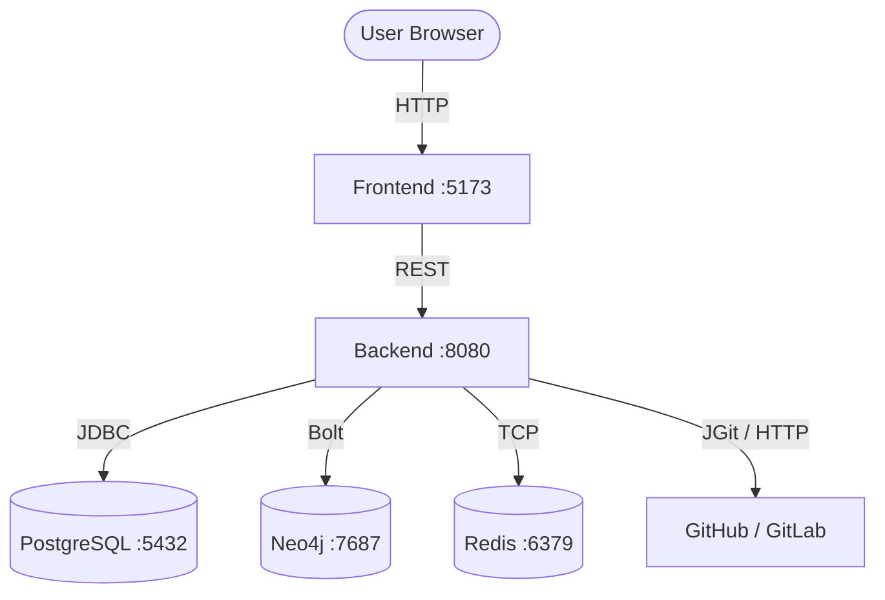

# RepoMind — AI-Powered GitHub Repository Visualizer

> **Google Maps for source code.** Explore any GitHub repository as an interactive knowledge graph — visualize files, classes, methods, REST endpoints, databases, and message queues, and discover circular dependencies, dead code, and commit hotspots.

<br/>

## Table of Contents

1. [Architecture Overview](#architecture-overview)
2. [Key Features](#key-features)
3. [Prerequisites](#prerequisites)
4. [Quick Start — Docker Compose](#quick-start--docker-compose)
5. [Step-by-Step Local Development Setup](#step-by-step-local-development-setup)
6. [Using the Application](#using-the-application)
7. [REST API Reference](#rest-api-reference)
8. [Project Structure](#project-structure)
9. [Running Tests](#running-tests)
10. [Extending the Parser](#extending-the-parser)
11. [Troubleshooting](#troubleshooting)

---

## Architecture Overview

RepoMind is a multi-container application orchestrated by Docker Compose:

| Layer | Technology | Purpose |
|---|---|---|
| **Frontend** | React 18 + TypeScript + Vite + React Flow + Monaco | Interactive graph canvas & code viewer |
| **Backend** | Java 21 + Spring Boot 3 + Maven | REST API, Git cloning, AST parsing |
| **Graph DB** | Neo4j 5 (Community) | Stores code entities and relationships |
| **Relational DB** | PostgreSQL 15 | Repository metadata & job state |
| **Cache** | Redis 7 | Parse progress, result caching |



---

## Key Features

- **Java AST Parsing** via `JavaParser` — extracts classes, methods, Spring annotations (`@RestController`, `@Service`, `@Repository`, `@Entity`, `@KafkaListener`, etc.)
- **JS / TypeScript AST Parsing** via a bundled Node.js subprocess using the TypeScript Compiler API
- **Interactive React Flow Graph** — custom neon-styled nodes (Files, Classes, Methods, Endpoints, Databases, Queues) with auto-layout
- **Focus / Neighborhood Mode** — isolate a node's direct callers and callees
- **Circular Dependency Detection** — Cypher cycle queries highlight import loops in red
- **Dead Code Reachability** — path analysis from entry points (main, endpoints, listeners) grays out unreachable methods
- **Git Hotspot Analysis** — JGit log scan counts commits per file to surface risky areas
- **Monaco Editor** — click any node to view its source code with full syntax highlighting
- **AI Assistant Chat Panel** — NLP-style graph filtering (e.g. *"Show API flow"*, *"Focus on database layer"*)

---

## Prerequisites

### For Docker Compose (recommended)
| Tool | Minimum Version | Install |
|---|---|---|
| Docker Desktop | 24+ | [docker.com](https://www.docker.com/products/docker-desktop/) |
| Docker Compose | v2.20+ (bundled with Desktop) | Included |

### For local development
| Tool | Minimum Version | Install |
|---|---|---|
| JDK | 21 | [Adoptium](https://adoptium.net/) or `brew install --cask temurin@21` |
| Maven | 3.9+ | `brew install maven` |
| Node.js | 18+ | [nodejs.org](https://nodejs.org/) or `brew install node` |
| Git | Any | Pre-installed on macOS / Linux |
| Docker Desktop | 24+ | Required to run Postgres, Neo4j, Redis |

---

## Quick Start — Docker Compose

> The fastest way to run the complete stack with a single command.

### 1. Clone the repository

```bash
git clone https://github.com/your-org/RepoMind.git
cd RepoMind
```

### 2. Start all services

```bash
docker compose up --build
```

This command will:
- Pull `postgres:15-alpine`, `neo4j:5.12-community`, and `redis:7-alpine`
- Build the Spring Boot backend image (Maven multi-stage build inside Docker)
- Build the React frontend image
- Start all 5 containers; Postgres, Neo4j, and Redis must pass health checks before the backend boots

> **First run note:** Downloading images and Maven dependencies takes ~2–5 minutes. Subsequent starts are much faster as layers are cached.

### 3. Open the application

| Service | URL |
|---|---|
| **RepoMind UI** | http://localhost:5173 |
| **Backend API** | http://localhost:8080 |
| **Neo4j Browser** | http://localhost:7474 &nbsp;(`neo4j` / `repomindpassword`) |

### 4. Stop the stack

```bash
# Stop containers (preserves data volumes)
docker compose stop

# Stop and remove containers + volumes (full reset)
docker compose down -v
```

### 5. Rebuild after code changes

```bash
# Rebuild only the backend
docker compose up --build -d backend

# Rebuild only the frontend
docker compose up --build -d frontend

# Rebuild everything
docker compose up --build -d
```

---

## Step-by-Step Local Development Setup

Use this setup when actively developing to get hot-reload and faster iteration.

### Step 1 — Start infrastructure services only

```bash
docker compose up postgres neo4j redis -d
```

Wait until all three are healthy:
```bash
docker compose ps
# postgres: healthy  neo4j: healthy  redis: healthy
```

### Step 2 — Configure environment (optional)

The default configuration in `backend/src/main/resources/application.yml` connects to localhost. If your services are on non-default ports, override them:

```bash
export SPRING_DATASOURCE_URL=jdbc:postgresql://localhost:5432/repomind
export SPRING_NEO4J_URI=bolt://localhost:7687
export SPRING_DATA_REDIS_HOST=localhost
```

### Step 3 — Run the backend

```bash
cd backend
mvn clean spring-boot:run
```

Confirm startup:
```
Started RepoMindApplication in X seconds
Tomcat started on port 8080
```

### Step 4 — Run the frontend

Open a new terminal:

```bash
cd frontend
npm install          # first time only
npm run dev
```

The Vite dev server starts at **http://localhost:5173** with hot module replacement enabled.

### Step 5 — Verify connectivity

```bash
# Backend health
curl http://localhost:8080/api/repositories

# Expected: [] (empty array if no repos yet)
```

---

## Using the Application

### Importing a repository

1. Click **"Import Repo"** in the top navbar.
2. Fill in the form:
   - **Name** — a display label (e.g. `spring-petclinic`)
   - **Git URL** — full clone URL (e.g. `https://github.com/spring-projects/spring-petclinic.git`)
   - **Branch** — target branch (default: `main`)
   - **Token** *(optional)* — GitHub personal access token for private repositories
3. Click **"Start Import & Parsing"**.
4. Ingestion runs asynchronously. The status cycles: `PENDING → IN_PROGRESS → COMPLETED` (or `ERROR`).

### Exploring the graph

| Action | Result |
|---|---|
| **Select repo** from navbar dropdown | Graph loads automatically |
| **Click a node** | Right sidebar shows metadata, git history, complexity |
| **Double-click a File/Class node** | Opens source code in Monaco Editor |
| **Click "Focus Neighborhood"** | Isolates the node's direct callers and callees |
| **Toggle filters** (left sidebar) | Show/hide Files, Classes, Methods, Endpoints, Databases, Queues |
| **Search bar** (navbar) | Autocomplete search across all indexed nodes |
| **Dashboard button** (navbar) | Opens analytics overlay: counts, hotspots chart, dead code gauge |

### AI Assistant Chat

In the right sidebar, type natural language queries to transform the graph view:
- *"Show API flow"* — isolates endpoint → controller → service layers
- *"Focus on database layer"* — highlights DB-connected nodes
- *"Show dead code"* — dims all reachable nodes, spotlights unreachable ones

---

## REST API Reference

Base URL: `http://localhost:8080/api/repositories`

| Method | Endpoint | Description |
|---|---|---|
| `POST` | `/` | Import a GitHub/GitLab repository by URL |
| `POST` | `/local` | Import a local directory path |
| `GET` | `/` | List all imported repositories |
| `GET` | `/{id}` | Get a single repository's metadata |
| `GET` | `/{id}/status` | Poll ingestion status (`PENDING`, `IN_PROGRESS`, `COMPLETED`, `ERROR`) |
| `GET` | `/{id}/graph` | Retrieve graph nodes & edges (filter with `?nodeTypes=File,Class,Method`) |
| `GET` | `/{id}/stats` | Summary metrics: node counts, circular deps, dead code count |
| `GET` | `/{id}/analysis` | Full report: circular dependencies, dead code list, git hotspots |
| `GET` | `/{id}/code` | Raw file content for Monaco Editor (`?path=relative/file/path`) |
| `GET` | `/{id}/node-details` | Node-level git history & complexity (`?nodeType=&nodeId=`) |
| `DELETE` | `/{id}` | Delete repository, graph nodes, and cloned files |

### Import request body examples

```bash
# GitHub repository
curl -X POST http://localhost:8080/api/repositories \
  -H "Content-Type: application/json" \
  -d '{
    "name": "spring-petclinic",
    "url": "https://github.com/spring-projects/spring-petclinic.git",
    "branch": "main"
  }'

# Private repository with token
curl -X POST http://localhost:8080/api/repositories \
  -H "Content-Type: application/json" \
  -d '{
    "name": "my-private-repo",
    "url": "https://github.com/my-org/private-repo.git",
    "branch": "develop",
    "token": "ghp_yourPersonalAccessToken"
  }'

# Local directory (container path)
curl -X POST http://localhost:8080/api/repositories/local \
  -H "Content-Type: application/json" \
  -d '{"name": "local-project", "path": "/app/clones/my-project"}'
```

---

## Project Structure

```
RepoMind/
├── .gitignore
├── .github/
│   └── workflows/
│       └── ci.yml                    # GitHub Actions CI pipeline
├── docker-compose.yml                # Orchestrates all 5 services
├── README.md
│
├── backend/                          # Spring Boot 3 / Java 21
│   ├── .dockerignore
│   ├── Dockerfile                    # Multi-stage Maven build
│   ├── pom.xml
│   └── src/main/java/com/repomind/
│       ├── RepoMindApplication.java
│       ├── config/                   # Spring Security, Redis, Neo4j config
│       ├── controller/
│       │   └── RepositoryController.java
│       ├── model/
│       │   ├── jpa/                  # PostgreSQL entities
│       │   └── neo4j/               # Neo4j node models
│       ├── repository/
│       │   ├── jpa/                  # Spring Data JPA
│       │   └── neo4j/               # Neo4jClient graph queries
│       ├── service/
│       │   ├── GitCloneService.java  # JGit clone & ZIP extraction
│       │   ├── GitHotspotService.java
│       │   └── ParserService.java    # Orchestrates AST → Neo4j pipeline
│       └── parser/
│           └── JavaCodeParser.java   # JavaParser AST walker
│   └── src/main/resources/
│       ├── application.yml
│       └── parser/
│           ├── ts-parser.js          # Node.js TypeScript/JS AST extractor
│           └── package.json
│
└── frontend/                         # React 18 + TypeScript + Vite
    ├── .dockerignore
    ├── Dockerfile
    ├── package.json
    ├── vite.config.ts
    ├── tailwind.config.js
    └── src/
        ├── App.tsx
        ├── components/
        │   ├── GraphCanvas.tsx       # React Flow canvas with custom nodes
        │   ├── Navbar.tsx            # Search, repo selector, exports
        │   ├── SidebarLeft.tsx       # Filter toggles & file explorer
        │   ├── SidebarRight.tsx      # Node details + AI Assistant
        │   ├── CodeViewer.tsx        # Monaco Editor slide-out panel
        │   ├── Dashboard.tsx         # Analytics overlay
        │   └── ImportModal.tsx       # Repository import form
        └── store/
            └── useStore.ts           # Zustand global state
```

---

## Running Tests

### Backend unit tests

```bash
cd backend
mvn test
```

Expected output:
```
Tests run: 1, Failures: 0, Errors: 0, Skipped: 0
BUILD SUCCESS
```

### Frontend type-check + build

```bash
cd frontend
npm run build
```

Expected output:
```
✓ built in ~500ms
dist/assets/index-*.js   ~400 kB
```

---

## Extending the Parser

To add support for a new language (e.g. Python, Kotlin, Go):

1. **Write a parser** in `backend/src/main/resources/parser/` (Node.js script) or a Java class in `backend/.../parser/`.
2. **Register the extension** in `ParserService.java` — add a branch for the new file extension that invokes your parser.
3. **Map to graph nodes** — call the appropriate `neo4jGraphRepository.merge*()` methods to persist files, classes, methods, and relationships.
4. **Add a test** in `backend/src/test/java/com/repomind/parser/` to verify extraction.

---

## Troubleshooting

### Neo4j health check failing on first start

Neo4j can take 30–60 seconds to initialize. The backend depends on `service_healthy` and will wait. If it times out:

```bash
docker compose logs neo4j
# Look for "Remote interface available at http://localhost:7474/"
docker compose restart backend
```

### Backend fails to connect to Neo4j

Verify Neo4j is healthy and the bolt port is reachable:
```bash
docker compose ps
docker exec repomind-neo4j cypher-shell -u neo4j -p repomindpassword "RETURN 1"
```

### Graph API returns 500 error

Check backend logs for exceptions:
```bash
docker logs repomind-backend --tail 50
```

### Frontend cannot reach backend

The frontend calls `http://localhost:8080` directly from your browser. Ensure:
- The backend container is running: `docker ps | grep repomind-backend`
- No firewall is blocking port 8080
- CORS is enabled (`@CrossOrigin(origins = "*")` is set on the controller)

### Ports already in use

If another service is using 5173, 8080, 5432, 7474, 7687, or 6379:
```bash
# Find the process using a port (e.g. 8080)
lsof -i :8080

# Or change the port in docker-compose.yml, e.g. "8181:8080"
```

### Resetting all data

```bash
docker compose down -v   # removes volumes (all graph data, postgres data)
docker compose up --build
```
